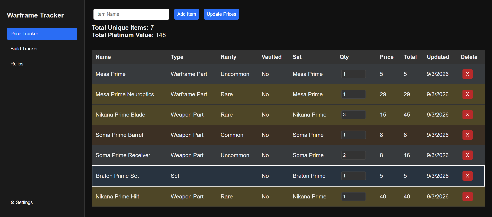
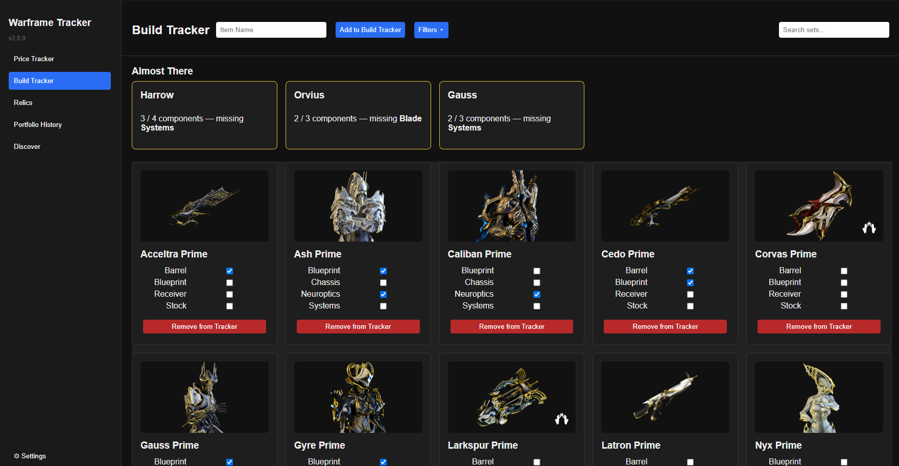
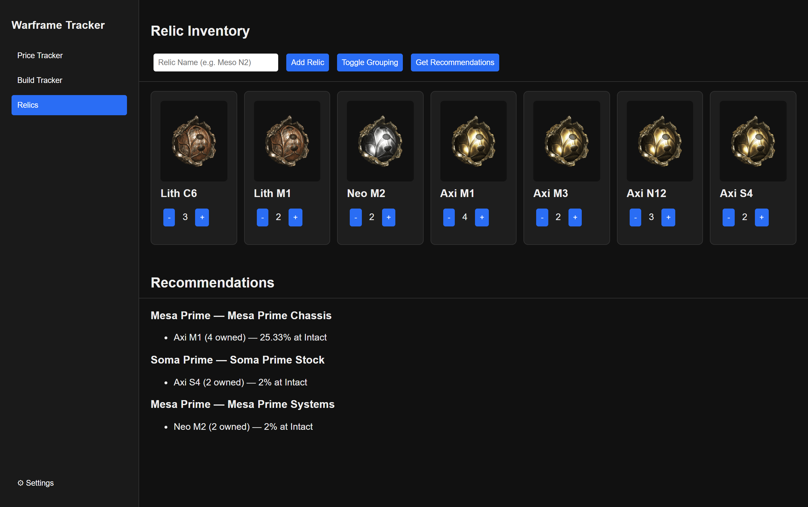

# Warframe Inventory Tracker

A desktop app for keeping track of what's sitting in your Warframe inventory, what it's worth, and what you still need to farm.

You add items by name, and the app pulls the rest in for you: current platinum prices and 90-day price history from [warframe.market](https://warframe.market), drop locations from [warframestat.us](https://warframestat.us), and full relic reward tables. It also tracks the Warframes and weapons you're building, checks off the components you already own, and tells you which of your relics are worth cracking next.

## Features

### Price Tracker

- Add items by name with autocomplete against the warframe.market catalog.
- Sortable inventory table: name, type, rarity, vaulted status, set, quantity, price, total value, and last-updated time.
- Rows are color-coded by rarity — bronze for Common, silver for Uncommon, gold for Rare — worked out from the component's actual drop chance rather than a fixed table.
- Running totals for unique items and total platinum value.
- **Update Prices** refreshes every item in one pass.
- Click an item's name to see where its components drop; click its price to open a 90-day price and volume history chart.



### Build Tracker

Track the sets you're actively building instead of guessing which part you're missing.

- Add a Warframe or weapon and get a card with a checklist of its components.
- Tick off parts as you get them; filter by type (**All**, **Warframes**, **Weapons**) and by rarity (**Any**, **Prime Only**, **Non-Prime Only**).
- Archwing frames, Archguns, and Archmelee weapons show a small badge on their card image.
- Combine owned components into a completed set — the parts are consumed and the set is added to your inventory.



### Relics

- Keep a count of the relics you own, shown as an image grid.
- Open any relic to see its full reward table.
- **Get Recommendations** takes you to a dedicated Recommendations page with two views:
  - **Tracked Set Gaps** — cross-references your relics against your build tracker and tells you which relics contain parts you still need, including which refinement tier to aim for. Grouped by set or by relic, your choice.
  - **Discover New Sets** — scans your relics against every Prime Warframe and weapon in the game, not just the ones you're tracking, and surfaces any set where your relics could cover at least 3 of its 4 components. One click adds a discovery straight to your Build Tracker.
- When you open a component's drop locations (from the Price Tracker or Build Tracker), any relic you already own is highlighted with its quantity.



### Settings

- Export your inventory and build tracker to a file, or import one back in.
- Restore the last auto-backup, taken automatically every time you close the app.
- Recompute rarity tiers and backfill relic images.
- Clear the farm-data cache (useful if an item unexpectedly shows no drop data — it's usually a stale cached result) or refetch the entire relic drop table.

## Install

Windows only.

1. Download the latest `Warframe Inventory Tracker Setup X.Y.Z.exe` from the [Releases page](https://github.com/williamstylerg/warframe-inventory-tracker/releases).
2. Run it. The installer isn't code-signed, so Windows SmartScreen will warn you — choose **More info → Run anyway**.

## Your data

Everything is stored locally, in `%APPDATA%\Warframe Inventory Tracker\`:

| File | Contents |
| --- | --- |
| `inventory.json` | Your tracked items, quantities, prices, and tiers |
| `buildTracker.json` | Sets you're building and which parts are checked off |
| `relicInventory.json` | Relics you own |
| `auto-backup.json` | Written automatically every time you close the app |
| `itemCache.json`, `farmDataCache.json`, `priceHistoryCache.json`, `relicDropCache.json` | Cached API responses |

Nothing is uploaded anywhere. The app only makes read-only requests to public Warframe APIs, and caches the responses so it isn't hammering them (farm data for 14 days, price history for 12 hours). If your data ever gets into a bad state, **Settings → Restore Last Auto-Backup** puts it back to how it looked when you last closed the app.

## Data sources

- [warframe.market](https://warframe.market) — platinum prices and price history
- [api.warframestat.us](https://api.warframestat.us) — item metadata and drop locations
- [drops.warframestat.us](https://drops.warframestat.us) — relic reward tables

Thanks to the people who maintain them.

## Running from source

You'll need [Node.js](https://nodejs.org) (which includes npm).

```bash
git clone https://github.com/williamstylerg/warframe-inventory-tracker.git
cd warframe-inventory-tracker
npm install
npm start
```

To build the Windows installer into `dist/`:

```bash
npm run build
```

### Project structure

| Path | What it does |
| --- | --- |
| `main.js` | Electron main process — all API calls, caching, and file storage, exposed over IPC |
| `preload.js` | The `window.api` bridge between the renderer and main process |
| `dashboard.html` | The UI, including styles |
| `dashboard.js` | Renderer logic — tables, cards, modals, charts |
| `bundled-relic-cache.json` | Relic drop tables shipped with the app so relics work before the first refresh |
| `scripts/build-relic-cache.js` | Regenerates that cache from drops.warframestat.us |

Price history charts use [Chart.js](https://www.chartjs.org/) loaded from a CDN, so they need an internet connection.

## License

MIT — see [LICENSE](LICENSE).

## Disclaimer

This is an unofficial fan-made tool. It isn't affiliated with or endorsed by Digital Extremes. Warframe and all related assets are trademarks of Digital Extremes Ltd.
