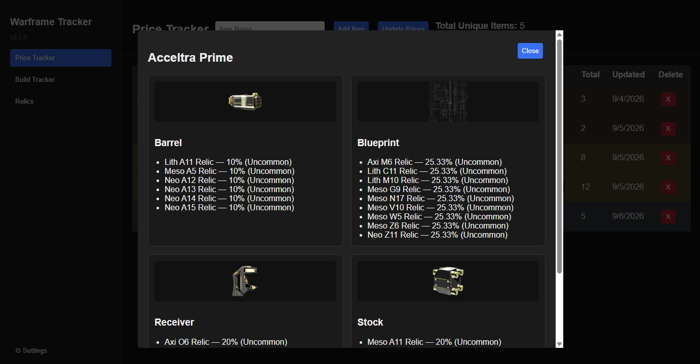
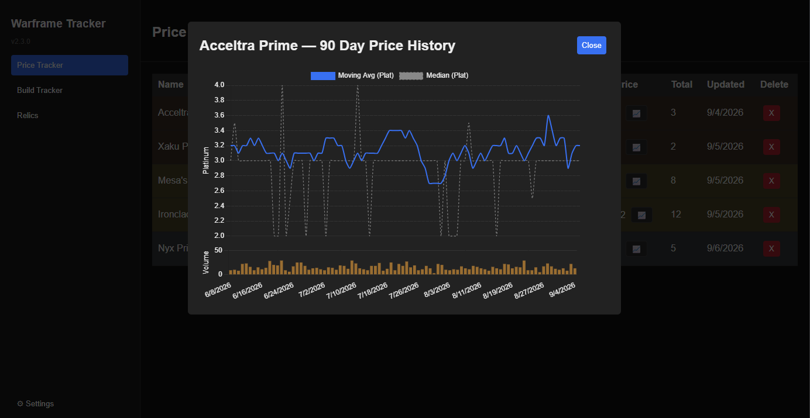
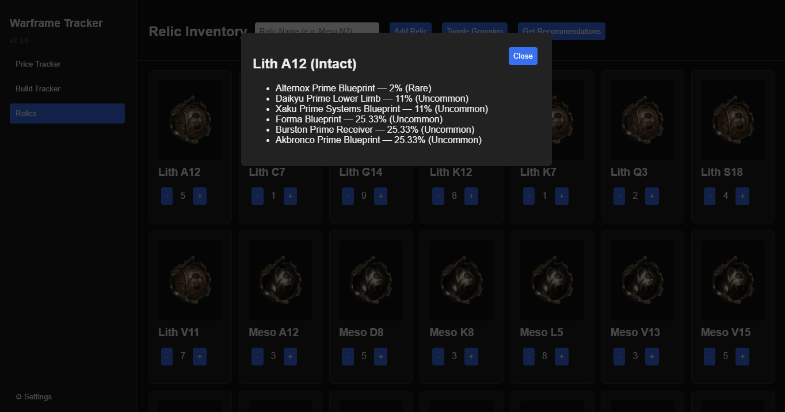
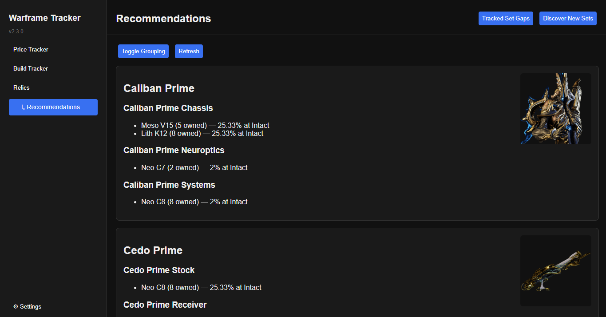
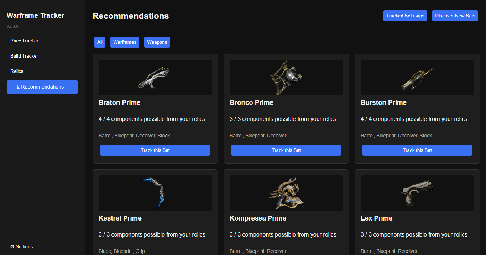
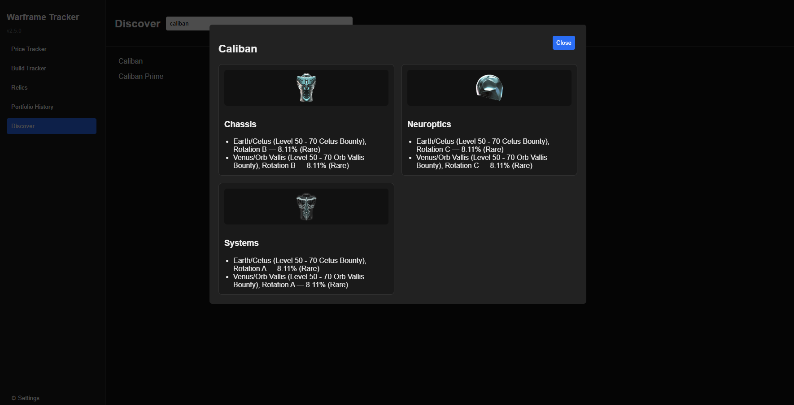
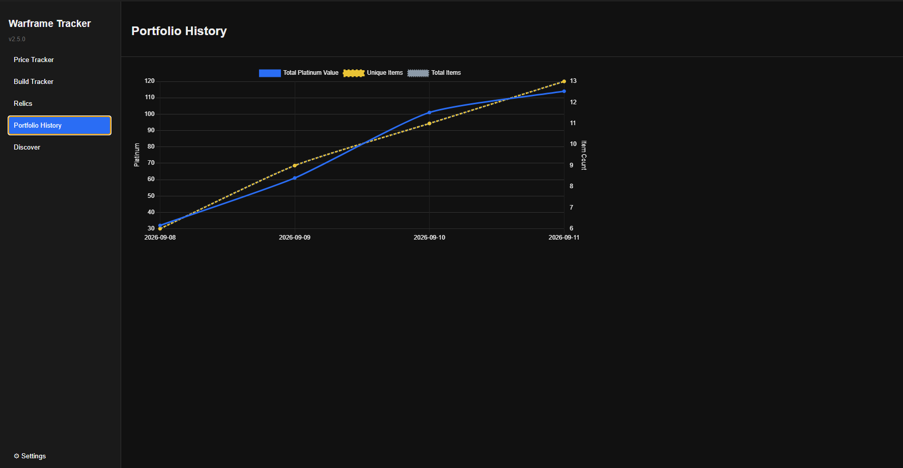

# Warframe Inventory Tracker

A desktop app for keeping track of what's sitting in your Warframe inventory, what it's worth, and what you still need to farm.

You add items by name, and the app pulls the rest in for you: current platinum prices and 90-day price history from [warframe.market](https://warframe.market), drop locations from [warframestat.us](https://warframestat.us), and full relic reward tables. It also tracks the Warframes and weapons you're building, checks off the components you already own, tells you which of your relics are worth cracking next, and can find you completely new sets to farm based on relics you already have.

## Features

### Price Tracker

- Add items by name with autocomplete against the warframe.market catalog.
- Sortable inventory table: name, type, rarity, vaulted status, set, quantity, price, total value, and last-updated time. Your sort choice sticks around as you add, update, or remove items.
- Rows are color-coded by rarity — bronze for Common, silver for Uncommon, gold for Rare — worked out from the component's actual drop chance rather than a fixed table.
- For tradable Prime components, a Plat vs. Ducat comparison tells you whether it's currently worth more to sell for platinum or trade in for ducats, using an exchange rate you can set yourself or have the app suggest from your own inventory's prices.
- A live search box filters the table as you type.
- Running totals for unique items and total platinum value.
- **Update Prices** refreshes every item in one pass.
- Click an item's name to see a grid of its components — each with its own image and full list of relic sources, showing which relics you already own. Click its price to open a 90-day price and volume history chart.
- Export your whole inventory to a CSV file from Settings.





### Build Tracker

Track the sets you're actively building instead of guessing which part you're missing.

- Add a Warframe or weapon and get a card with a checklist of its components.
- Tick off parts as you get them; use the **Filters** dropdown to narrow by type (Warframes/Weapons) and rarity (Prime/Non-Prime), or search by name. Sets are sorted alphabetically with Primes listed first.
- An **Almost There** section at the top flags any set you're just one component away from finishing.
- Combine owned components into a completed set — the parts are consumed and the set is added to your inventory.
- Archwing frames, Archguns, and Archmelee weapons show a small badge on their card image.


### Relics

- Keep a count of the relics you own, shown as an image grid, sorted by tier and relic number. Search to filter down to a specific relic.
- Open any relic to see its full reward table.
- **Get Recommendations** takes you to a dedicated Recommendations page with two views:
  - **Tracked Set Gaps** — cross-references your relics against your build tracker and tells you which relics contain parts you still need, including which refinement tier to aim for. Grouped by set or by relic, your choice.
  - **Discover New Sets** — scans your relics against every Prime Warframe and weapon in the game, not just the ones you're tracking, and surfaces any set where your relics could cover at least 3 of its 4 components. One click adds a discovery straight to your Build Tracker.
- When you open a component's drop locations (from the Price Tracker or Build Tracker), any relic you already own is highlighted with its quantity.






### Discover

A standalone search across every Warframe, weapon, mod, and relic in the game — not just what you own or track. Search for anything and jump straight to its drop locations or reward table.



### Portfolio History

A snapshot of your total platinum value, unique item count, and total item count is taken every time you close the app. The Portfolio History page charts all of it over time, so you can see your collection's value trend as you play.



### Settings

- Export your inventory and build tracker to a file, or import one back in.
- Restore the last auto-backup, taken automatically every time you close the app.
- Recompute rarity tiers, backfill relic images, and backfill ducat values.
- Clear the farm-data cache (useful if an item unexpectedly shows no drop data — it's usually a stale cached result) or refetch the entire relic drop table.

## Install

Windows only.

1. Download the latest `Warframe Inventory Tracker Setup X.Y.Z.exe` from the [Releases page](https://github.com/williamstylerg/warframe-inventory-tracker/releases).
2. Run it. The installer isn't code-signed, so Windows SmartScreen will warn you — choose **More info → Run anyway**.
3. After that, the app checks for updates on launch and will offer to install new versions automatically.

## Your data

Everything is stored locally, in `%APPDATA%\Warframe Inventory Tracker\`:

| File | Contents |
| --- | --- |
| `inventory.json` | Your tracked items, quantities, prices, and tiers |
| `buildTracker.json` | Sets you're building and which parts are checked off |
| `relicInventory.json` | Relics you own |
| `portfolioHistory.json` | Your platinum value/item count history, one snapshot per day |
| `appSettings.json` | App preferences (currently just your plat-per-ducat rate) |
| `auto-backup.json` | Written automatically every time you close the app |
| `itemCache.json`, `farmDataCache.json`, `priceHistoryCache.json`, `relicDropCache.json` | Cached API responses |

Nothing is uploaded anywhere. The app only makes read-only requests to public Warframe APIs, and caches the responses so it isn't hammering them (farm data for 14 days, price history for 12 hours). If your data ever gets into a bad state, **Settings → Restore Last Auto-Backup** puts it back to how it looked when you last closed the app.

## Data sources

- [warframe.market](https://warframe.market) — platinum prices and price history
- [api.warframestat.us](https://api.warframestat.us) — item metadata and drop locations
- [drops.warframestat.us](https://drops.warframestat.us) — relic reward tables

Thanks to the people who maintain them.

## Running from source

You'll need [Node.js](https://nodejs.org) (which includes npm).

```bash
git clone https://github.com/williamstylerg/warframe-inventory-tracker.git
cd warframe-inventory-tracker
npm install
npm start
```

To build the Windows installer into `dist/`:

```bash
npm run build
```

This bundles the renderer (`src/renderer.js` → `dashboard-bundle.js`) with esbuild before packaging — running `npm run build` or `npm run release` handles this automatically.

### Project structure

| Path | What it does |
| --- | --- |
| `main.js` | Electron main process entry point — window creation, auto-update, and app lifecycle |
| `preload.js` | The `window.api` bridge between the renderer and main process |
| `src-main/` | Main-process logic, split into stores (local JSON storage) and services (API calls, business logic), plus `ipcHandlers.js` which wires them all up to the renderer |
| `dashboard.html` | The UI markup and styles |
| `src/renderer.js` | Renderer entry point — event delegation, page navigation, startup |
| `src/modules/` | Renderer logic split by feature (price tracker, build tracker, relics, recommendations, discover, modals, settings, portfolio) |
| `dashboard-bundle.js` | The built output of `src/renderer.js` — generated, not edited directly |
| `farmLogic.js` | Pure drop-rate/tier calculation logic, covered by the Jest test suite |
| `bundled-relic-cache.json` | Relic drop tables shipped with the app so relics work before the first refresh |
| `scripts/build-relic-cache.js` | Regenerates that cache from drops.warframestat.us |

Price history charts use [Chart.js](https://www.chartjs.org/) loaded from a CDN, so they need an internet connection.

### Development tooling

- `npm run lint` / `npm run format` — ESLint and Prettier
- `npm test` — Jest test suite for the pure calculation logic
- Every push runs both automatically via GitHub Actions

## License

GPL-3.0 — see [LICENSE](LICENSE). This means anyone can use, modify, and share this project, but any distributed modified version must also be open source under GPL-3.0. It doesn't restrict Digital Extremes' own rights over Warframe itself — see the disclaimer below.

## Disclaimer

This is an unofficial fan-made tool. It isn't affiliated with or endorsed by Digital Extremes. Warframe and all related assets are trademarks of Digital Extremes Ltd.